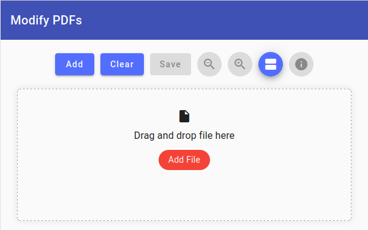

Simple webapp to modify PDF files:
* reorder and delete individual pages
* change PDF Meta data
* [demo](https://modify-pdf.netlify.app/)
* running completly in your browser, without sharing data with anyone

# Modify PDFs

## Libraries
Credits to:
* [Angular Material](https://material.angular.io/): Theme
* [file-saver](https://github.com/eligrey/FileSaver.js)
* [pdf-lib](https://pdf-lib.js.org/): create and modify PDF documents
* [pdfjs-dist](https://github.com/mozilla/pdfjs-dist): parsing and rendering PDFs

## Development server

Run `ng serve` for a dev server. Navigate to `http://localhost:4200/`. The application will automatically reload if you change any of the source files.

## Build

Run `ng build` to build the project. The build artifacts will be stored in the `dist/` directory.
